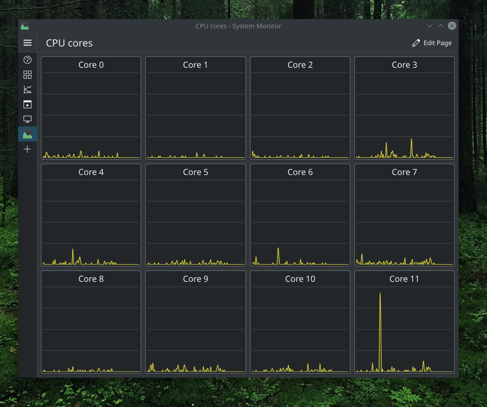

# cpu-cores

Script to generate individual cpu cores view for new (as of 2020) plasma-systemmonitor. I made this because I found the default view, where all cores are in the same graph, hard to read and I like the way Windows task manager shows the cores individually.

As of april 2021, the plasma-systemmonitor doesn't have scripting capability nor a view for variable amount of cores so I wrote this.

